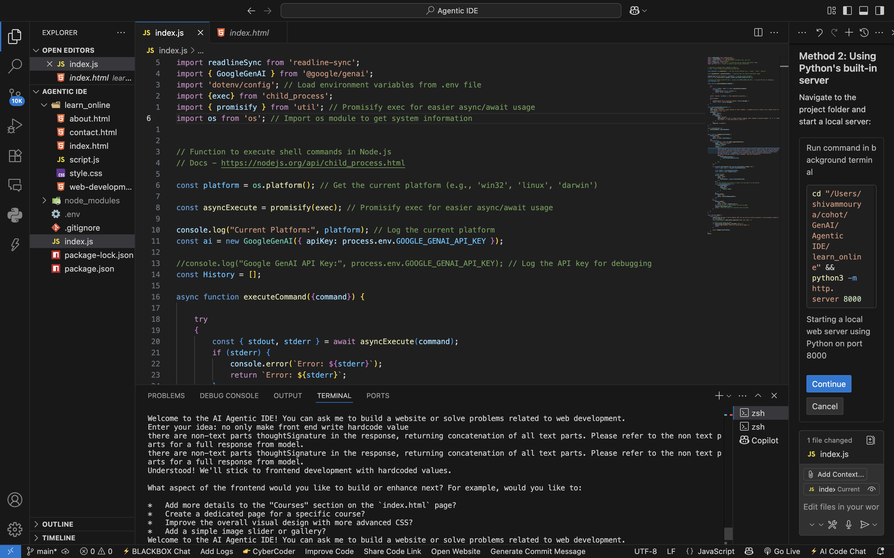

# AI Agentic IDE - Intelligent Website Builder

An AI-powered development tool that automatically creates complete websites using Google's Gemini AI. This project demonstrates the power of AI agents that can understand user requirements and execute terminal commands to build functional web applications.

## 🚀 What We Have Built

This project is an **AI Agentic IDE** (Integrated Development Environment) that can:

- **Understand Natural Language**: Accepts website requirements in plain English
- **Execute Commands Automatically**: Runs terminal/shell commands to create files and folders
- **Build Complete Websites**: Creates HTML, CSS, and JavaScript files with full content
- **Cross-Platform Support**: Works on macOS, Linux, and Windows
- **Interactive Development**: Provides real-time feedback during the development process

### Example Projects Created:
- ✅ Course Selling Website (`learn_online` folder)
- ✅ Student Portfolio Website
- ✅ Multi-page websites with navigation
- ✅ Contact forms and interactive elements

## 🛠️ Technologies Used

### Core Technologies:
- **Node.js** - Runtime environment for JavaScript
- **ES6 Modules** - Modern JavaScript module system
- **Google Gemini AI** - Advanced language model for code generation

### AI & Machine Learning:
- **Google GenAI SDK** - Official Google Generative AI library
- **Function Calling** - AI agent can execute predefined functions
- **Conversation History** - Maintains context across interactions

### Development Tools:
- **readline-sync** - Interactive command-line interface
- **child_process** - Execute shell commands from Node.js
- **dotenv** - Environment variable management
- **promisify** - Convert callback-based functions to promises

## 📦 Dependencies Installed

```json
{
  "@google/genai": "^1.8.0",     // Google Generative AI SDK
  "child_process": "^1.0.2",     // Execute shell commands
  "dotenv": "^17.0.1",          // Environment variables
  "os": "^0.1.2",               // Operating system utilities
  "readline-sync": "^1.4.10",   // Interactive CLI input
  "util": "^0.12.5"             // Node.js utilities
}
```

## ⚙️ Setup and Installation

### Prerequisites:
- **Node.js** (v14 or higher)
- **npm** (Node Package Manager)
- **Google AI API Key** (from Google AI Studio)

### Step 1: Clone/Download the Project
```bash
# Navigate to your project directory
cd "Agentic IDE"
```

### Step 2: Install Dependencies
```bash
# Initialize npm (if not already done)
npm init

# Install required packages
npm install readline-sync @google/genai dotenv child_process util os
```

### Step 3: Set Up Environment Variables
Create a `.env` file in the root directory:
```bash
# Create .env file
touch .env
```

Add your Google AI API key:
```env
GOOGLE_GENAI_API_KEY=your_api_key_here
```

> **Get API Key**: Visit [Google AI Studio](https://makersuite.google.com/app/apikey) to generate your free API key.

### Step 4: Configure Package.json
Ensure your `package.json` includes:
```json
{
  "type": "module"
}
```

## 🚀 How to Run This Project

### Method 1: Direct Execution
```bash
# Run the AI agent
node index.js
```

### Method 2: Using npm scripts (Optional)
Add to `package.json`:
```json
{
  "scripts": {
    "start": "node index.js",
    "dev": "node index.js"
  }
}
```

Then run:
```bash
npm start
# or
npm run dev
```

## 💡 Usage Examples

### Example 1: Creating a Portfolio Website
```
Enter your idea: create a student portfolio website with 3 pages
```

The AI will automatically:
1. Create project folder
2. Generate HTML files (index.html, about.html, contact.html)
3. Create CSS file with styling
4. Add JavaScript file for interactivity
5. Write complete content to all files

### Example 2: Building a Business Website
```
Enter your idea: build a course selling website with navigation and contact form
```

## 🎯 Project Architecture

```
Agentic IDE/
├── index.js              # Main AI agent application
├── package.json          # Project dependencies and configuration
├── .env                  # Environment variables (API keys)
├── ReadMe.md            # Project documentation
└── Generated Projects/
    ├── learn_online/    # Course selling website
    │   ├── index.html
    │   ├── about.html
    │   ├── contact.html
    │   ├── style.css
    │   └── script.js
    └── student_portfolio/ # Portfolio website
        ├── index.html
        ├── about.html
        ├── projects.html
        ├── style.css
        └── script.js
```

## 🤖 How the AI Agent Works

### 1. **User Input Processing**
- Accepts natural language descriptions
- Parses requirements for website type and features

### 2. **Command Generation**
- AI generates appropriate shell commands
- Creates folder structure and files
- Writes HTML, CSS, and JavaScript content

### 3. **Execution Pipeline**
```javascript
User Input → AI Processing → Command Generation → Shell Execution → File Creation
```

### 4. **Function Calling**
The AI uses predefined functions:
- `executeCommand()`: Runs shell commands
- Supports: mkdir, touch, echo, cat, etc.

## 📸 Project Screenshots

### Screenshot 1: AI Agent in Action


### Screenshot 2: Terminal View



## 🔧 Advanced Features

### 1. **Cross-Platform Compatibility**
- Automatically detects OS (macOS, Linux, Windows)
- Adjusts commands based on platform

### 2. **Error Handling**
- Catches and reports command execution errors
- Provides detailed error messages

### 3. **Conversation Memory**
- Maintains chat history for context
- Allows follow-up questions and modifications

### 4. **Real-time Feedback**
- Shows commands being executed
- Displays success/error status

## 🛡️ Security Considerations

- **API Key Protection**: Store in `.env` file, never commit to version control
- **Command Validation**: AI executes only safe file operations
- **Sandbox Environment**: Commands run in project directory only


## 🐛 Troubleshooting

### Common Issues:

1. **API Key Error**
   ```bash
   Error: API key not found
   ```
   **Solution**: Check your `.env` file and API key

2. **Module Not Found**
   ```bash
   Error: Cannot find module
   ```
   **Solution**: Run `npm install` to install dependencies

3. **Permission Denied**
   ```bash
   Error: EACCES: permission denied
   ```
   **Solution**: Ensure write permissions in project directory


## 👨‍💻 Author

**Shivam Mourya** - 

## 🤝 Contributing

1. Fork the repository
2. Create a feature branch
3. Commit your changes
4. Push to the branch
5. Create a Pull Request

## 📞 Support

For questions or issues:
- Create an issue in the repository
- Check the troubleshooting section
- Review Google AI documentation

---

**Happy Coding! 🚀** Let the AI build your websites while you focus on the bigger picture!